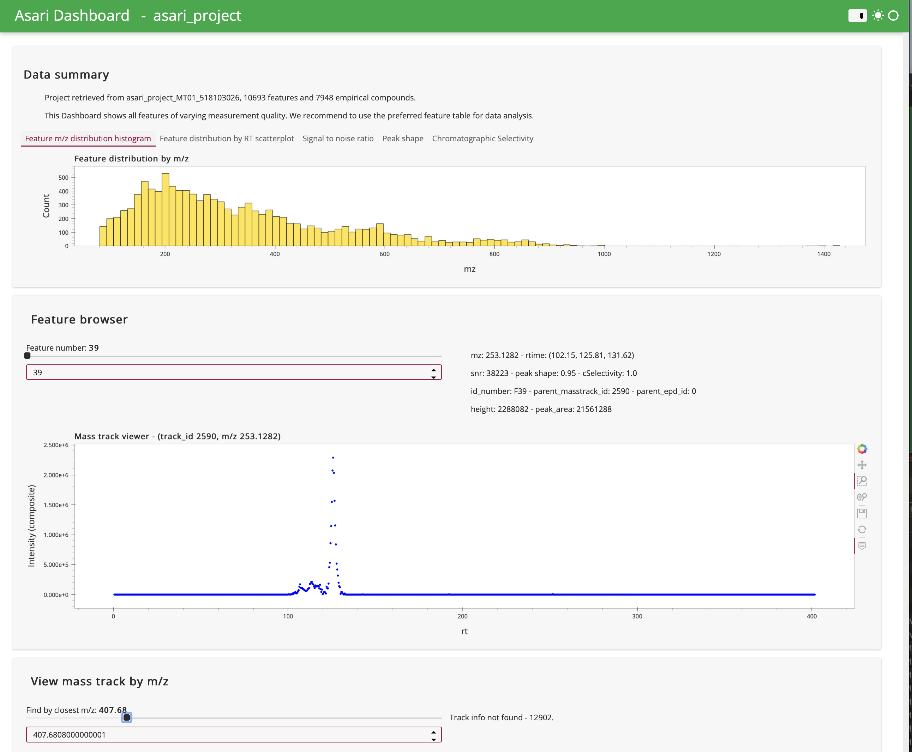
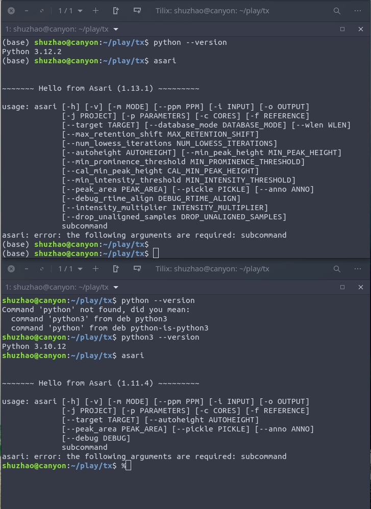

Asari
=====
[](https://asari.readthedocs.io/en/latest/?badge=latest)
[](https://doi.org/10.1038/s41467-023-39889-1)

Trackable and scalable Python program for high-resolution LC-MS metabolomics data preprocessing ([Li et al. Nature Communications 14.1 (2023): 4113](https://www.nature.com/articles/s41467-023-39889-1)):

- Taking advantage of high mass resolution to prioritize mass separation and alignment
- Peak detection on a composite map instead of repeated on individual samples
- Statistics guided peak dection, based on local maxima and prominence, selective use of smoothing
- Reproducible, track and backtrack between features and EICs
- Tracking peak quality, selectiviy metrics on m/z, chromatography and annotation databases
- Scalable, performance conscious, disciplined use of memory and CPU 
- Transparent, JSON centric data structures, easy to chain other tools

A web server (https://asari.app) and [full pipeline](https://pypi.org/project/pcpfm/) are available now.

A set of tutorials are hosted at https://github.com/shuzhao-li-lab/asari_pcpfm_tutorials/.

Install
=======
- From PyPi repository: `pip3 install asari-metabolomics`. Add `--upgrade` to update to new versions.

- Or clone from source code: https://github.com/shuzhao-li/asari . One can run it as a Python module by calling Python interpreter. GitHub repo is often ahead of PyPi versions.

- Requires Python 3.8+. Installation time ~ 5 seconds if common libraries already exist.

- One can use the web version (https://asari.app) without local installation.

Input
=====

The default workflow, intended for LC-MS experiments, requires only centroided mzML files as input. These input data may be centroided using the ThermoRawFileParser (https://github.com/compomics/ThermoRawFileParser) to convert Thermo .RAW files to .mzML. 
Msconvert in ProteoWizard (https://proteowizard.sourceforge.io/tools.shtml) can handle the conversion of most vendor data formats and .mzXML files. Other workflows may have other optional or mandatory inputs.

MS/MS spectra are ignored by asari. 
Our pipeline (https://pypi.org/project/pcpfm/) has annotation steps to use MS/MS data.

Use 
===
If installed from pip, one can run `asari` as a command in a terminal, followed by a subcommand for specific tasks.

For help information:

`asari -h`

To process all mzML files under directory mydir/projectx_dir:

`asari process --mode pos --input mydir/projectx_dir`

Alternatively if given a list of absolute paths to mzML files:

`asari process --mode pos --input mzML_path_list.txt`

To get statistical description on a single file (useful to understand data and parameters)

`asari analyze --input mydir/projectx_dir/file_to_analyze.mzML`

To get annotation on a tab delimited feature table:

`asari annotate --mode pos --ppm 10 --input mydir/projectx_dir/feature_table_file.tsv`

To do automatic esitmation of min peak height, add this argument:

`--autoheight True`

To output additional extraction table on a targeted list of m/z values from target_mzs.txt:

`asari extract --input mydir/projectx_dir --target target_mzs.txt`

This is useful to add QC check during data processing, e.g. the target_mzs.txt file can be spike-in controls.

To launch a dashboard in your web browser after the project is processed into directory process_result_dir:

`asari viz --input process_result_dir`

Alternative to a standalone command, to run as a module via Python interpreter, one needs to point to module location, e.g.:

`python3 -m asari.main process --mode pos --input mydir/projectx_dir`

Output
======
A typical run on disk may generatae a directory like this

    rsvstudy_asari_project_427105156
    ├── Annotated_empricalCompounds.json
    ├── Feature_annotation.tsv
    ├── export
    │   ├── _mass_grid_mapping.csv
    │   ├── cmap.pickle
    │   ├── full_Feature_table.tsv
    │   └── unique_compound__Feature_table.tsv
    ├── pickle
    │   ├── Blank_20210803_003.pickle
    │   ├── ...
    ├── preferred_Feature_table.tsv
    └── project.json

The recommended feature table is `preferred_Feature_table.tsv`. 

All peaks are kept in `export/full_Feature_table.tsv` if they meet signal (snr) and shape standards 
(part of input parameters but default values are fine for most people). 
That is, if a feature is only present in one sample, it will be reported, 
as we think this is important for applications like exposome and personalized medicine. 
The filtering decisions are left to end users.

The `pickle` folder keeps intermediate files during processing.
They are removed after the processing by default, to save disk space.
Users can choose to keep them by specifying `--pickle True`.


Dashboard
=========
After data are processed, users can use `asari viz --input process_result_dir` to launch a dashboard to inspect data, where 'process_result_dir' refers to the result folder. The dashboard uses these files under the result folder: 'project.json', 'export/cmap.pickle', 'export/epd.pickle' and 'export/full_Feature_table.tsv'. Thus, one can move around the folder, but modification of these files is not a good idea. Please note that pickle files are for internal use, and one should not trust pickle files from other people.
 



Parameters
==========

Only two parameters in Asari should be routinely modified. 

The first is the mass accuracy of the instrument in ppm. By default this is set to 5 ppm which is suitable for many modern instruments. This can be modified by passing `--ppm <ppm_val>` to the Asari command.

The Second is the workflow used for an experiment. The default workflow is optimized for LC-MS. Alternatively workflows may be specified using the `--workflow` parameter. Current options include 'LC' for default, or 'GC' for GC data with retention index standards. GC mode also requires passing the `--RI_landmarks` flag pointing to an appropriately formated file indicating the location of retention index standards. 

Default ionization mode is `pos`. Change to `neg` if needed, by specifying `--mode neg` in command line.

Users can supply a custom parameter file `xyz.yaml`, via `--parameters xyz.yaml` in command line.
A template YAML file can be found at `test/parameters.yaml`.

When the above methods overlap, command line arguments take priority.
That is, commandline overwrites `xyz.yaml`, which overwrites default asari parameters in `defaul_parameters.py`. 

Algorithms
==========
Basic data concepts follow https://github.com/shuzhao-li/metDataModel, organized as

    ├── Experiment
       ├── Sample
           ├── MassTrack
               ├── Peak
               ├── Peak
           ├── MassTrack 
               ├── Peak
               ├── Peak
        ...
       ├── Sample 
        ...
       ├── Sample 

A sample here corresponds to an injection file in LC-MS experiments. 
A MassTrack is an extracted chromatogram for a specific m/z measurement, governing full retention time.
Therefore, a MassTrack may include multiple mass traces, or EICs/XICs, as referred by literature.
Peak (an elution peak at specific m/z) is specific to a sample, but a feature is defined at the level of an experiment after correspondence.

Additional details:
- Use of MassTracks simplifies m/z correspondence, which results in a MassGrid
- Two modes of m/z correspondence: a clustering method for studies >= N (default 10) samples; 
    and a slower method based on landmark peaks and verifying mass precision.
- Chromatogram construction is based on m/z values via flexible bins and frequency counts (in lieu histograms). 
- Elution peak alignment is based on LOWESS
- Use integers for RT scan numbers and intensities for computing efficiency
- Avoid mathematical curves whereas possible for computing efficiency

Selectivity is tracked for
- mSelectivity, how distinct are m/z measurements 
- cSelectivity, how distinct are chromatograhic elution peaks

Step-by-step algorithms are explained in doc/README.md.

This package uses `mass2chem`, `khipu` and `JMS` for mass search and annotation functions.

Performance
===========
Asari is designed to run > 1000 samples on a laptop computer. The performance is achieved via
- Implementation of basic functions using discrete mathematics and avoiding continuous curves.
- Main intensity values of each sample are not kept in memory.
- Simple (and transparent) peak detection based on local maxima (no curve fitting until evaluation)
- Composite mass tracks greatly reduce the run cycles on peak detection
- Using Python numerical libraries and vector operations
- Alignment of mass tracks uses clustering in larger sample size

By default, experiments with 10 or fewer samples, will be processed entirely in memory and the MassGrid assembly uses a slower algorithm to compensate statistical distribution. Larger experiments are processed using ondisk data structures unless specified otherwise using the `--database_mode <mode>` flag. `memory` mode will keep all data in memory, super fast but few machines will have enough memory for a large experiment. `ondisk` keeps intermediates as pickle on disk, sacrificing some performance for scalability. `compressed` is like `ondisk` but the files are compressed before storage, saving considerable space at considerable computational cost. `smart` is a hybrid mode that uses a mixture of memory, ondisk and compressed but has higher overhead. `ondisk` is the current default but future versions will use `smart` instead.

Future improvement can be made by implementing some functions, e.g. chromatogram building, in C.

Platforms, Anaconda and Docker
==============================
**Desktop vs Cloud**

Python itself is used on Windows, Mac and Linux. Users may encouter problems related to Python not to asari, in which cases your best option is to find your local IT friend. We are a small team of scientists. There is no plan to build a desktop graphic application, but we do a lot of cloud computing. If you don't like command lines (many people don't), please feel free to try out the web server (https://asari.app). The free server has a quota. Please contact us if you find yourself in need of substantial cloud resources.

**Anaconda and conda, virtual environments**

Anaconda has various channels to distribute conda pacages. After looking into conda distribution, I came to the conclusion that it's not worth the effort to maintain a separate package on conda-forge.  The concern is that once we put in a conda package in public distribution, long-term maintenance of it and related packages will be potential issues. Pip is always in conda and one can use the same `pip install asari-metabolomics` in conda environment.

Conda is excellent in handling virtual environments. Because we often use tools of different dependencies, virtual environments are great for preventing conflicts. This screen shot shows asari 1.13.1 installed in conda "base" environment and 1.11.4 in my native system environment.


**What happened to Docker?**

My daily computer has an M2 chip, so that I haven't used Docker for a while. The use of virtual environments (see above) removes a lot of need of Docker.

There's a Dockerfile in GitHub repo and one can build an image from there. There's an older Docker image built on Intel chip at https://hub.docker.com/r/shuzhao/asari.
This image includes mono and ThermoRawFileParser, which converts Thermo .raw files to .mzML files.

Example use
To launch with volume mapping `$ docker run -v /Users/shuzhao/data:/home -ti shuzhao/asari`.

In the container, ThermoRawFileParser is under `/usr/local/thermo/`.
```
# mono /usr/local/thermo/ThermoRawFileParser.exe -d my_data_dir

# asari analyze --input tmp/file_008.mzML 

# asari process --mode neg --input tmp --output test99
```

Discussion and Future Plans
===========================
**Known limitations**
- The current version was mostly developed for Orbitrap data, less tested on TOF.
- Default elution peak detection is based on local maxima using statistically guided parameters. For highly complex local EIC, additional algorithm may be needed.

**Next steps in development**
- Implementation of `join` function to facilitate better parallelization. The goal is to have 'native' level of matching features when large datasets are split and processed separately. This can be equivalent function of matching different datasets.
- To improve TOF support. This maybe related to better construction of mass tracks when the m/z space gets too crowded.
- Automated handling of sample clusters, since different sample types may be included in an experiment.
- To add GC-MS support (mostly RT optimization, deconvolution and library search).

**How accurate are my m/z values?**

The mass tracks are scaffolds to assemble data. Very close m/z values may not be distinguished on a mass track. For example, when mass tracks are constructed for 5 ppm resolution, two m/z values of 3 ppm apart will be reported on the same mass track. This leads to a situation where the m/z values are not optimal. Asari is designed for reliable information retrieval. If the data are processed under 5 ppm, the information can be retrieved by 5 ppm. The true m/z values will be recovered via annotation, if the features are resolved by LC, when asari features are matched to annotation libraries.

As discussed in the manuscript, ppm is not perfect in modeling mass resolution and is not constant for all m/z ranges. It is a practical tool we currently work with. If two compounds are not resolved by LC and their m/z values are 4 ppm apart, asari processing by 5 ppm will treat them as one feature. If the mass resolution is justified, one can run asari using, for instance, 3 ppm. The default workflow in asari does not fine-tune the m/z values, because the split m/z peaks from centroiding are difficult to distinguish from real m/z peaks. We leave the fine-tuning to annotation or targeted extraction workflow.

We thank reviewer #1 for valuable discussions on this topic.


Asari suite and Related projects
================================
The asari suite includes 
- asari (Source code: https://github.com/shuzhao-li/asari, Package Repository: https://pypi.org/project/asari-metabolomics/)
- metDataModel: data models for metabolomics (https://github.com/shuzhao-li-lab/metDataModel)
- mass2chem: common utilities in interpreting mass spectrometry data, annotation (https://github.com/shuzhao-li-lab/mass2chem)
- khipu: a Python library for generalized, low-level annotation of MS metabolomics (https://github.com/shuzhao-li-lab/khipu)
- JMS: Json's Metabolite Services. Search functions, annotation and metabolic models (https://github.com/shuzhao-li-lab/JMS)
- pcpfm pipeline (https://github.com/shuzhao-li-lab/PythonCentricPipelineForMetabolomics)
- asari-x: the eXposome miner (to be released)


Links for the asari paper:
- Test data: https://github.com/shuzhao-li/data/tree/main/data
- Notebooks to reproduce publication figures: https://github.com/shuzhao-li/data/tree/main/notebooks

The khipu paper: https://pubs.acs.org/doi/10.1021/acs.analchem.2c05810

The pipeline and datamodel paper: https://doi.org/10.1371/journal.pcbi.1011912 

Tutorial on asari and the pipeline: https://github.com/shuzhao-li-lab/asari_pcpfm_tutorials
