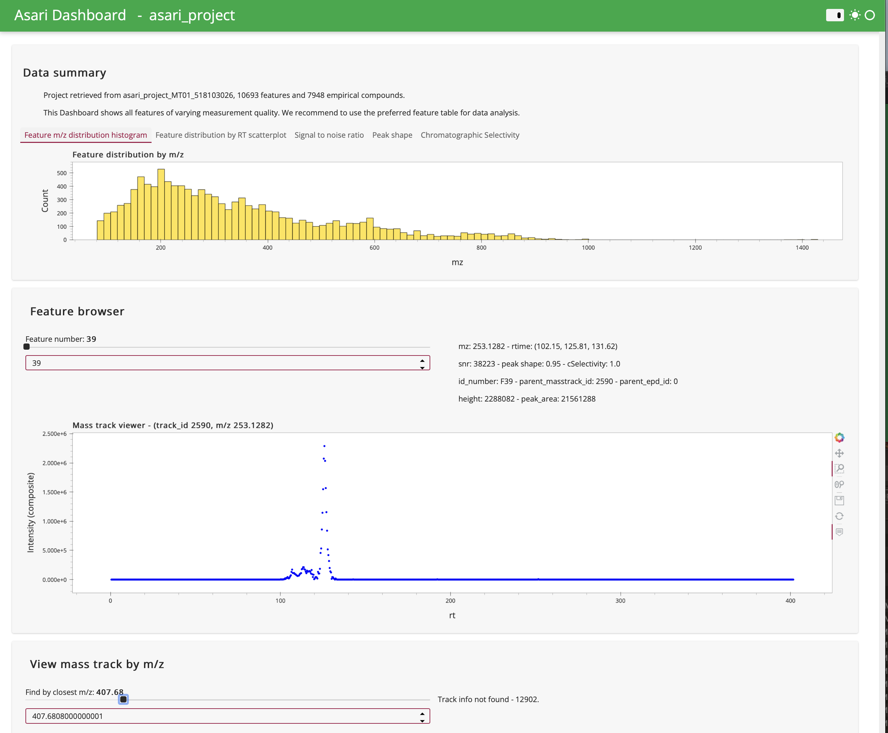
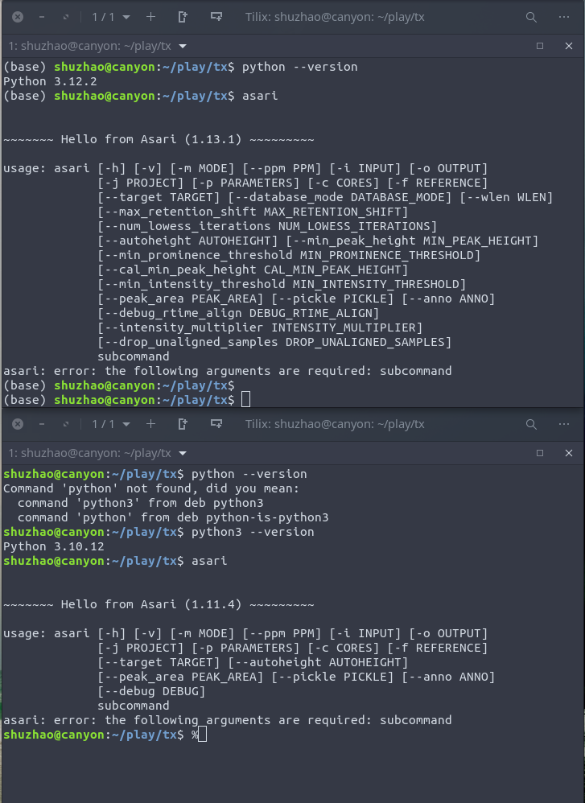

# Asari

[](https://asari.readthedocs.io/en/latest/?badge=latest)
[](https://doi.org/10.1038/s41467-023-39889-1)

Trackable and scalable Python program for high-resolution metabolomics data processing. 

- Taking advantage of high mass resolution to prioritize mass separation and alignment
- Peak detection on a composite map instead of repeated on individual samples
- Statistics guided peak dection, based on local maxima and prominence, selective use of smoothing
- Reproducible, track and backtrack between features and mass tracks (EICs)
- Tracking peak quality, selectiviy metrics on m/z, chromatography and annotation databases
- Scalable, performance conscious, disciplined use of memory and CPU 
- Transparent, JSON centric data structures, easy to chain other tools

LC-MS application was described in Li et al. Nature Communications 14.1 (2023): 4113](https://www.nature.com/articles/s41467-023-39889-1). GC-MS workflow was added to version 1.16.6.

A web server (https://asari.app) and [full pipeline](https://pypi.org/project/pcpfm/) are available now.
A set of tutorials are hosted at https://github.com/shuzhao-li-lab/asari_pcpfm_tutorials/.

## Install

- From PyPi repository: `pip3 install asari-metabolomics`. Add `--upgrade` to update to new versions.
- Or clone from source code: https://github.com/shuzhao-li/asari . One can run it as a Python module by calling Python interpreter. GitHub repo is often ahead of PyPi versions.
- Requires Python 3.8+. Installation time ~ 5 seconds if common libraries already exist.
- The core package is designed to be compact and cloud friendly. The visualization and other dependencies are additional, specified in `optional-requirements.txt`.
- One can use the web version (https://asari.app) without local installation.

If installed from pip and the system path includes asari, one can run `asari` as a command in a terminal. 
Alternatively, one can run it as a module via Python interpreter, e.g.:
`python3 -m asari.main process -i mydir`


## Input
### Data processing
Input data are centroid mzML files from LC, GC or DI-MS metabolomics. 
Example datasets can be found at https://github.com/shuzhao-li-lab/data.

We use ThermoRawFileParser (https://github.com/compomics/ThermoRawFileParser) to convert Thermo .RAW files to .mzML. Msconvert in ProteoWizard (https://proteowizard.sourceforge.io/tools.shtml) can handle the conversion of most vendor data formats and .mzXML files.

MS/MS spectra are ignored in default LC-MS workflow but handled by alternative workflows.

### Raw data inspection and quality control
Asari function `analyze` returns a summary on a single mzML file.

The `tools.plot_scan_seq` module gives scan level visualization of a single mzML file.  

Various tools will be added over time. Single-file QC works on a single mzML file; most QC functions work on the processed full feature table.

### Annotation
The design of asari is to spearate annotation from feature extraction. 

Pre-annation, i.e., grouping ions to empirical compounds, is done using [Khipu](https://github.com/shuzhao-li-lab/khipu). 

Annotation typically involves compound libraries and databases. Please refer to specific workflows. 

Flash entropy is used in some MS/MS search. See notebooks/index_spectral_db.ipynb on preparing the database from MSP or JSON.

### Pipelines
An example pipeline is [PCPFM](https://pypi.org/project/pcpfm/), which includes data processing, annotation, QC and data wrangling. Thermo raw files conversion is included in PCPFM. 

Different workflows can be put together using different modules. We will continue releasing examples as notebooks. 

## Use 

The `asari` as a command can run in a terminal, followed by a subcommand for specific tasks.
For help information: `asari -h`

### Main usages

To process all mzML files under directory mydir/projectx_dir:

`asari process --mode pos --input mydir/projectx_dir`

To annotate GC-MS feature table using a custom database and alkane standards:

`asari annotate -i project_311234834/export/full_Feature_table.tsv 
-o project_311234834 -j gc_annotation_311234834 
--kovats /Users/lish/li.proj/asari_project/GCHRMS/KovatsIndex_alkanestandards_cuimc.tsv 
--db /Users/lish/li.proj/asari_project/GCHRMS/Resources/GCHRMS_Database_251217.msp 
--denovo F --workflow GC
`

To use LC-MS/MS workflow to produce feature tables and MS/MS clusters:

`asari process --mode pos --input mydir/projectx_dir --workflow LCMSMS
`

To search MS/MS agains a database:

`annotate --db /Users/lish/li.proj/Resources/MSMS_database.pkl -i mydir/projectx_dir/ms2_spectra.json -o mydir/projectx_dir/ --workflow LCMSMS
`


To pre-annotate LC-MS feature table then match to a database (default HMDB for now):

`asari annotate -i /Users/lish/li.play/test16_v16_599432/preferred_Feature_table.tsv -o /Users/lish/li.play/test16_v16_599432/ -j LCMSanno --workflow LC --mode pos`

### Various tools

To launch a dashboard in your web browser after the project is processed into directory process_result_dir:

`asari viz --input process_result_dir`

To get statistical description on a single file (useful to understand data and parameters):

`asari analyze --input mydir/projectx_dir/file_to_analyze.mzML`

Please check documentation and demo notebooks for additional uses. 

## Output

A typical run of data processing may generatae a directory like this

    rsvstudy_asari_project_427105156
    ├── Annotated_empricalCompounds.json
    ├── Feature_annotation.tsv
    ├── export
    │   ├── _mass_grid_mapping.csv
    │   ├── cmap.pickle
    │   ├── full_Feature_table.tsv
    │   └── unique_compound__Feature_table.tsv
    ├── pickle
    │   ├── Blank_20210803_003.pickle
    │   ├── ...
    ├── preferred_Feature_table.tsv
    └── project.json

The recommended feature table is `preferred_Feature_table.tsv`. 

All peaks are kept in `export/full_Feature_table.tsv` if they meet signal (snr) and shape standards 
(part of input parameters but default values are fine for most people). 
That is, if a feature is only present in one sample, it will be reported, 
as we think this is important for applications like exposome and personalized medicine. 
The filtering decisions are left to end users.

An example output feature table is `test/HighOnly_HILICpos_preferred_Feature_table.tsv`, which was generated by:
    `asari process -i MT202304_2phase_HILICpos -o highonly --min_peak_height 1000000`

The `pickle` folder keeps intermediate files during processing.
They are removed after the processing by default, to save disk space.

## Dashboard

After data are processed, users can use `asari viz --input process_result_dir` to launch a dashboard to inspect data, where 'process_result_dir' refers to the result folder. The dashboard uses these files under the result folder: 'project.json', 'export/cmap.pickle', 'export/epd.pickle' and 'export/full_Feature_table.tsv'. Thus, one can move around the folder, but modification of these files is not a good idea. Please note that pickle files are for internal use, and one should not trust pickle files from other people.
 


## Parameters

In most cases, only `mode` and `mz_tolerance_ppm` require attention. The latter is set at 5 ppm by default. Most modern instruments are fine with 5 ppm, but one may want to change if needed.

Default ionization mode is `pos`. Change to `neg` if needed, by specifying `--mode neg` in command line.

Users can supply a custom parameter file `xyz.yaml`, via `--parameters xyz.yaml` in command line.
A template YAML file can be found at `test/parameters.yaml`.

When the above methods overlap, command line arguments take priority.
That is, commandline overwrites `xyz.yaml`, which overwrites default asari parameters in `default_parameters.py`. 

## Algorithms

Basic data concepts follow https://github.com/shuzhao-li/metDataModel, organized as

    ├── Experiment
       ├── Sample
           ├── MassTrack
               ├── Peak
               ├── Peak
           ├── MassTrack 
               ├── Peak
               ├── Peak
        ...
       ├── Sample 
        ...
       ├── Sample 

A sample here corresponds to an injection file in LC-MS experiments. 
A MassTrack is an extracted chromatogram for a specific m/z measurement, governing full retention time.
Therefore, a MassTrack may include multiple mass traces, or EICs/XICs, as referred by literature.
Peak (an elution peak at specific m/z) is specific to a sample, but a feature is defined at the level of an experiment after correspondence.

Additional details:
- Use of MassTracks simplifies m/z correspondence, which results in a MassGrid
- Two modes of m/z correspondence: a clustering method for studies >= N (default 10) samples; 
    and a slower method based on landmark peaks and verifying mass precision.
- Chromatogram construction is based on m/z values via flexible bins and frequency counts (in lieu histograms). 
- Elution peak alignment is based on LOWESS
- Use integers for RT scan numbers and intensities for computing efficiency
- Avoid mathematical curves whereas possible for computing efficiency

Selectivity is tracked for
- mSelectivity, how distinct are m/z measurements 
- cSelectivity, how distinct are chromatograhic elution peaks

Step-by-step algorithms are explained in doc/README.md.

This package uses `mass2chem`, `khipu` and `JMS` for mass search and annotation functions.

## Performance

Asari is designed to run > 1000 samples on a laptop computer. The performance is achieved via
- Implementation of basic functions using discrete mathematics and avoiding continuous curves.
- Main intensity values of each sample are not kept in memory.
- Simple (and transparent) peak detection based on local maxima (no curve fitting until evaluation)
- Composite mass tracks greatly reduce the run cycles on peak detection
- Using Python numerical libraries and vector operations
- Alignment of mass tracks uses clustering in larger sample size

When a study has N (default 10) or fewer samples, the MassGrid assembly uses a slower algorithm to compensate statistical distribution.

## Platforms, Anaconda and Docker

**Desktop vs Cloud**

Python itself is used on Windows, Mac and Linux. Users may encouter problems related to Python not to asari, in which cases your best option is to find your local IT friend. 
Asari is designed to be cloud friendly. There is no plan to build a complete desktop graphic application. 

If you don't like command lines (many people don't), please feel free to try out the web server (https://asari.app). The free server has a quota. Please contact us if you find yourself in need of substantial cloud resources.

**Anaconda and conda, virtual environments**

Anaconda has various channels to distribute conda pacages. After looking into conda distribution, I came to the conclusion that it's not worth the effort to maintain a separate package on conda-forge.  The concern is that once we put in a conda package in public distribution, long-term maintenance of it and related packages will be potential issues. Pip is always in conda and one can use the same `pip install asari-metabolomics` in conda environment.

Conda is excellent in handling virtual environments. Because we often use tools of different dependencies, virtual environments are great for preventing conflicts. This screen shot shows asari 1.13.1 installed in conda "base" environment and 1.11.4 in my native system environment.


**Docker Usage**

The use of virtual environments makes using Docker largely obselete; however, virtual environments do not handle OS-level dependencies well. For example, the ThermoRawFileParser is a C# program that needs to be installed on the system level and MatchMS has strict version requirements. If you are having issues running or installing Asari in your native environment, use one of the dockerfiles as an alternative.

Two docker files are provided in the repository, a prod dockerfile and a dev dockerfile. The prod dockerfile is for production use and uses the published versions of Asari suite packages. The dev dockerfile is for development use and installs the main Asari branch from github. This branch should be fully functional and often has new features not present in the release version; however, the dev version is for testing only. 

The images are multi-platform, based on an Debian Buster image. You will need to have Docker installed on your system to use these. 

Both Dockerfiles provide mono and the ThermoRawFileParser, which converts Thermo .raw files to .mzML files. 

To build the container, you will need to run the following command in the terminal:

`docker build -t <IMAGE_NAME> -f <DOCKERFILE> .` from within the Asari directory.

Then you can interact with the container using `docker run -ti <IMAGE_NAME> bash`. 

Note that docker essentially partitions your computer into separate environments, so any data you want to use in the container will need to be mounted as a volume. See below for examples on processing data with the container. You can pass the directory with your data `<INPUT_DATA>` and mount it as `<CONTAINER_PATH>` in the container by running:

` docker run -v <INPUT_DATA>:<CONTAINER_PATH> -ti <IMAGE_NAME> bash`.

See below for examples on processing data with the container. 
 
Example use
To launch with volume mapping `$ docker run -v /Users/shuzhao/data:/home -ti <shuzhao/asari>`.

In the container, ThermoRawFileParser is under `/usr/local/thermo/`.
```
# mono /usr/local/thermo/ThermoRawFileParser.exe -d my_data_dir

# asari analyze --input tmp/file_008.mzML 

# asari process --mode neg --input tmp --output test99
```


## Discussion and Future Plans

**Known limitations**
- The current version was mostly developed for Orbitrap data, less tested on TOF.
- Default elution peak detection is based on local maxima using statistically guided parameters. For highly complex local EIC, additional algorithm may be needed.

**Next steps in development**
- Implementation of `join` function to facilitate better parallelization. The goal is to have 'native' level of matching features when large datasets are split and processed separately. This can be equivalent function of matching different datasets.
- To improve TOF support. This maybe related to better construction of mass tracks when the m/z space gets too crowded.
- Automated handling of sample clusters, since different sample types may be included in an experiment.

**How accurate are my m/z values?**

The mass tracks are scaffolds to assemble data. Very close m/z values may not be distinguished on a mass track. For example, when mass tracks are constructed for 5 ppm resolution, two m/z values of 3 ppm apart will be reported on the same mass track. This leads to a situation where the m/z values are not optimal. Asari is designed for reliable information retrieval. If the data are processed under 5 ppm, the information can be retrieved by 5 ppm. The true m/z values will be recovered via annotation, if the features are resolved by LC, when asari features are matched to annotation libraries.

As discussed in the manuscript, ppm is not perfect in modeling mass resolution and is not constant for all m/z ranges. It is a practical tool we currently work with. If two compounds are not resolved by LC and their m/z values are 4 ppm apart, asari processing by 5 ppm will treat them as one feature. If the mass resolution is justified, one can run asari using, for instance, 3 ppm. The default workflow in asari does not fine-tune the m/z values, because the split m/z peaks from centroiding are difficult to distinguish from real m/z peaks. We leave the fine-tuning to annotation or targeted extraction workflow.

We thank reviewer #1 for valuable discussions on this topic.


## Extensions

The core package is designed to be compact. We encourage building extensions on top of asari. Various workflows have been built for different applications and we will continue to release them (e.g. as notebooks). 

Many derived applications are possible. E.g. a prototype desktop graphic interface is included in the source code and someone can develop it into a full project. 


## Asari suite and Related projects

The asari suite includes 
- asari (Source code: https://github.com/shuzhao-li/asari, Package Repository: https://pypi.org/project/asari-metabolomics/)
- metDataModel: data models for metabolomics (https://github.com/shuzhao-li-lab/metDataModel)
- mass2chem: common utilities in interpreting mass spectrometry data, annotation (https://github.com/shuzhao-li-lab/mass2chem)
- khipu: a Python library for generalized, low-level annotation of MS metabolomics (https://github.com/shuzhao-li-lab/khipu)
- JMS: Json's Metabolite Services. Search functions, annotation and metabolic models (https://github.com/shuzhao-li-lab/JMS)
- Full pipeline (pcpfm) including asari processing, QC and annotation based on standards and MS/MS (https://github.com/shuzhao-li-lab/PythonCentricPipelineForMetabolomics)
- asari-x: the eXposome miner (to be released)


Links for the asari paper:
- Test data: https://github.com/shuzhao-li/data/tree/main/data
- Notebooks to reproduce publication figures: https://github.com/shuzhao-li/data/tree/main/notebooks

The khipu paper: https://pubs.acs.org/doi/10.1021/acs.analchem.2c05810

The pipeline and datamodel paper: https://doi.org/10.1371/journal.pcbi.1011912 

Tutorial on asari and the pipeline: https://github.com/shuzhao-li-lab/asari_pcpfm_tutorials
